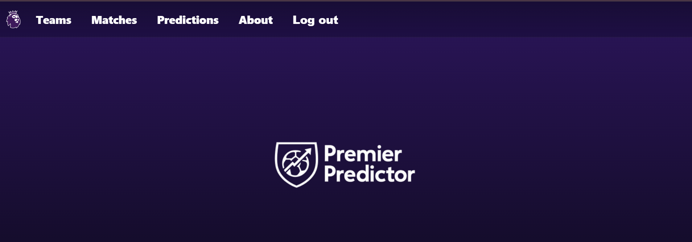
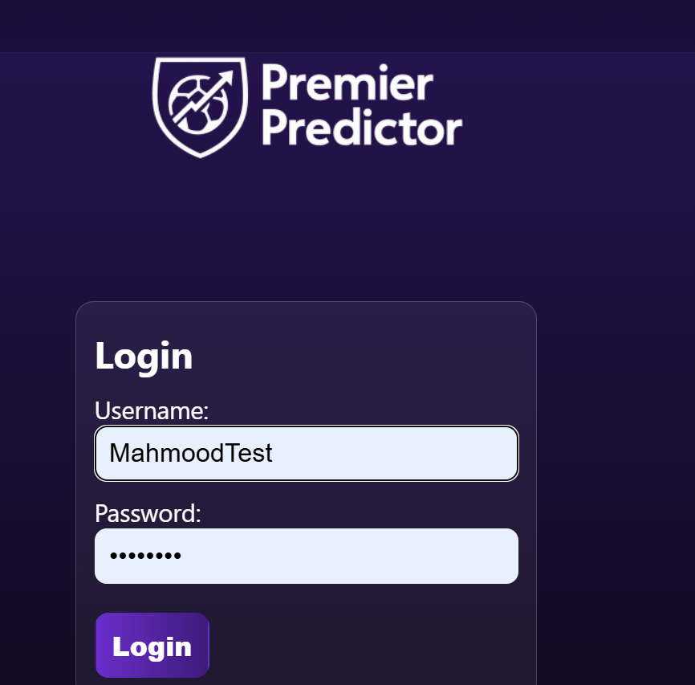
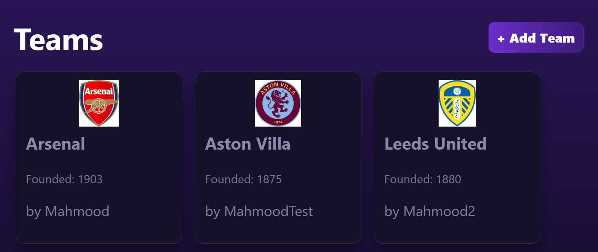
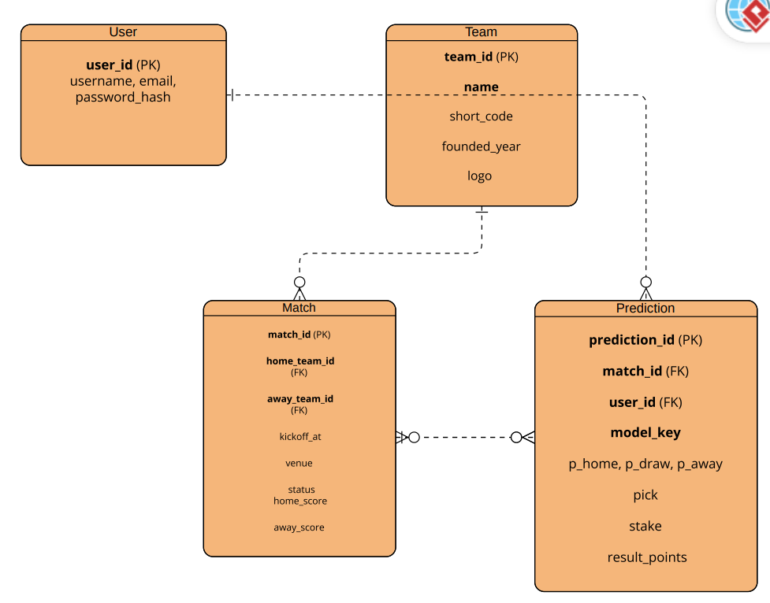

# ⚽ PremierPredictor

PremierPredictor is a web application that allows users to **predict football match results** and track their performance over time. It is designed to bring fans closer to the game with fun, interactive predictions where users can see predictions from other users.

---

## 📝 About the App
PremierPredictor is a full-stack **Django web application** for football (soccer) fans who want to predict outcomes of **English Premier League** matches.  

- Users can **sign up, log in, and manage predictions** for upcoming fixtures.  
- Each match includes home/away teams, kickoff date/time, and results (once available).  
- Predictions track a user’s pick (home/draw/away) and optional probability inputs.  
- Teams and matches are shared publicly, but only their creator can edit or delete them.  
- Protects data integrity: Teams with scheduled matches cannot be deleted until dependent matches are resolved.  

The app was built to combine my passion for the Premier League with my experience in **full-stack software engineering**. It demonstrates clean CRUD, media uploads, form validation, and user access control.

---

## How the app looks like





📋 **Planning Materials:**  
### Wirefarme
[WireFrame](https://excalidraw.com/#json=feE8KOHw6J5PpKaYZTpw3,bOAcUPDCYGuciMVVs24bkQ)
### Trelloboard
[Trellobaord](https://trello.com/b/O4i0GB5J/premierpredictor)
### ERD 


## 🚀 Getting Started

To run locally:

```bash
git clone https://github.com/yourusername/premierpredictor.git
cd premierpredictor
pipenv install
pipenv shell
python manage.py migrate
python manage.py runserver
```
Then open http://127.0.0.1:8000 in your browser.

## 🛠️ Technologies Used

- Backend: Python, Django, SQLite (dev)

- Frontend: HTML, CSS, Django Templates

- Auth: Django built-in authentication

- Media Handling: Django FileField + Pillow

- Planning Tools: Trello, Draw.io (wireframes)

- Version Control: Git & GitHub

## 🔮 Next Steps

- Add leaderboards for users based on prediction accuracy.

- Implement match result auto-import from an EPL API.

- Add charts and dashboards for win probability visualizations.

- Improve mobile responsiveness with a tighter CSS framework.